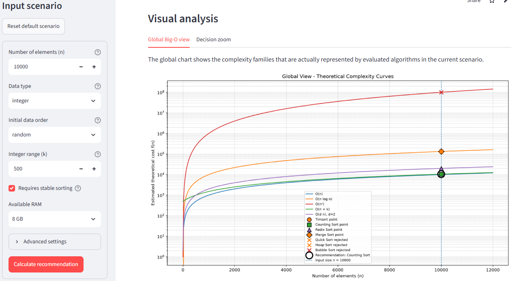

# Big-O Sorting Advisor

A visual and educational tool that explains which sorting strategy makes the most sense for a described data scenario.



## Why this project exists

Calling `sort()` is easy.

Understanding why a sorting strategy is appropriate is harder.

In Python, sorting data can be as simple as:

```python
sorted(data)
```

or:

```python
data.sort()
```

However, this does not explain the decision behind the operation.

A sorting strategy depends on several technical constraints:

- input size;
- data type;
- initial data order;
- integer value range;
- stability requirement;
- available memory;
- theoretical complexity;
- algorithm eligibility.

This project makes that reasoning visible.

## What the app does

The Big-O Sorting Advisor does not sort the data directly.

Instead, it receives a scenario description and evaluates which sorting strategy makes the most sense.

The app currently considers:

- `Timsort`
- `Counting Sort`
- `Radix Sort`
- `Merge Sort`
- `Quick Sort`
- `Heap Sort`
- `Bubble Sort` as an educational reference

For each algorithm, the app estimates:

- theoretical cost;
- effective complexity family;
- stability;
- memory usage;
- eligibility for recommendation;
- reason for not being eligible, when applicable.

## Core decision rule

The recommendation is not selected only by the lowest Big-O curve.

The correct decision rule is:

```text
Recommended algorithm = lowest theoretical cost among eligible practical algorithms
```

An algorithm may have a good theoretical complexity and still not be eligible for the scenario.

Examples:

- Counting Sort can be efficient, but it requires integer-like data.
- Quick Sort can be fast on average, but it is not stable in its standard form.
- Heap Sort is memory efficient, but it is not stable.
- Bubble Sort is useful for education, but not for practical recommendation.

## Example scenario

Input:

```text
n = 10,000
data type = integer
initial order = random
integer range k = 500
stability required = True
available RAM = 8 GB
```

In this scenario, the app recommends:

```text
Counting Sort
```

Reason:

```text
Counting Sort is compatible with integer data, stable, memory-feasible,
and has the lowest theoretical cost among eligible practical algorithms.
```

The estimated cost is:

```text
O(n + k) = 10,000 + 500 = 10,500
```

This is lower than:

```text
Radix Sort:    O(d n)
Timsort:       O(n log n)
Merge Sort:    O(n log n)
Bubble Sort:   O(n²)
```

## How the decision works

The app follows this decision pipeline:

```text
[Start]
  |
  v
[Read input scenario]
  |
  v
[Build candidate algorithm list]
  |
  v
[Evaluate data type compatibility]
  |
  v
[Evaluate stability requirement]
  |
  v
[Evaluate memory feasibility]
  |
  v
[Estimate theoretical cost]
  |
  v
[Mark each algorithm as eligible or not eligible]
  |
  v
[Keep all evaluated algorithms in the comparison]
  |
  v
[Rank only eligible practical algorithms by theoretical cost]
  |
  v
[Recommend the lowest-cost eligible practical algorithm]
```

The distinction is important:

```text
Not eligible does not mean not evaluated.
```

Algorithms that are not eligible for recommendation can still appear in the comparison table and plots because they help explain the trade-offs.

## Algorithm summary

| Algorithm | Main idea | Stable | Typical model in this app | Role |
|---|---:|---:|---:|---|
| Timsort | Exploits existing ordered runs | Yes | `O(n)` or `O(n log n)` | Practical |
| Counting Sort | Counts integer occurrences | Yes | `O(n + k)` | Practical |
| Radix Sort | Sorts by digit/group passes | Yes | `O(d n)` | Practical |
| Merge Sort | Splits, sorts, and merges | Yes | `O(n log n)` | Practical |
| Quick Sort | Partitions around a pivot | No | `O(n log n)` or `O(n²)` | Practical |
| Heap Sort | Uses a heap structure | No | `O(n log n)` | Practical |
| Bubble Sort | Repeated adjacent swaps | Yes | `O(n²)` | Educational |

## Visual outputs

The app generates two main visual analyses.

### Global Big-O view

Shows the complexity families represented by the evaluated algorithms in the current scenario.

If a curve appears in the chart, at least one evaluated algorithm point belongs to that curve.

### Decision zoom

Focuses on the relevant cost region around the selected input size `n`.

Algorithms with much larger costs may be omitted from the zoom so the decision region remains readable.

## Project structure

```text
big-o-sorting-advisor/
│
├── app.py
├── sorting_advisor.py
├── requirements.txt
├── README.md
├── LICENSE
├── .gitignore
│
├── docs/
│   └── big_o_sorting_advisor_technical_note_v02.tex
│
└── assets/
    └── bigo_01.png
```

## Run locally

Clone the repository:

```bash
git clone https://github.com/douglasdschons/big-o-sorting-advisor.git
cd big-o-sorting-advisor
```

Install dependencies:

```bash
pip install -r requirements.txt
```

Run the Streamlit app:

```bash
streamlit run app.py
```

Alternative:

```bash
python -m streamlit run app.py
```

## Technical note

A more detailed explanation is available in the technical note:

```text
docs/big_o_sorting_advisor_technical_note_v02.tex
```

The technical note explains:

- the decision model;
- eligibility logic;
- memory estimation;
- theoretical cost models;
- sorting mechanisms;
- limitations;
- future improvements.

## Current limitations

This is an educational and theoretical decision tool.

It does not measure real runtime.

It does not answer:

```text
Which algorithm is fastest on this exact machine?
```

It answers:

```text
Which sorting strategy makes the most sense theoretically for this described scenario?
```

Current limitations:

- memory estimates are simplified;
- constants hidden by Big-O are not modeled;
- CPU/cache effects are not modeled;
- implementation-specific optimizations are not benchmarked;
- object sorting assumes a valid comparison key exists;
- Radix Sort and Quick Sort models are simplified.

## Future improvements

Possible next steps:

- replace remaining `Rejected` labels in the interface with `Not eligible`;
- add benchmark mode;
- add interactive Plotly charts;
- export scenario reports;
- compare multiple scenarios;
- add Intro Sort and Bucket Sort;
- improve memory estimation;
- publish the app with Streamlit Cloud.

## Portfolio context

This project is part of an engineering-to-software transition portfolio.

It demonstrates:

- Python programming;
- Streamlit app development;
- algorithmic reasoning;
- Big-O complexity analysis;
- technical decision modeling;
- software modularization;
- data visualization;
- technical documentation.

The goal is not only to use programming syntax.

The goal is to use software to make technical reasoning visible.
